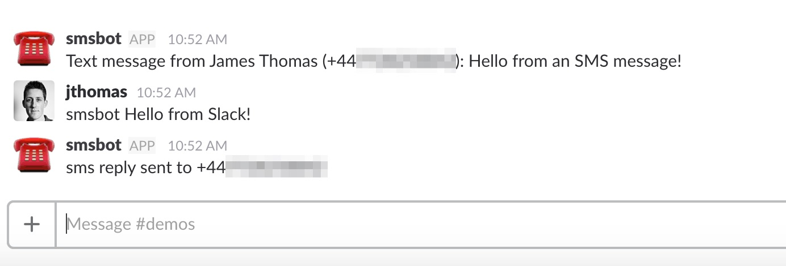
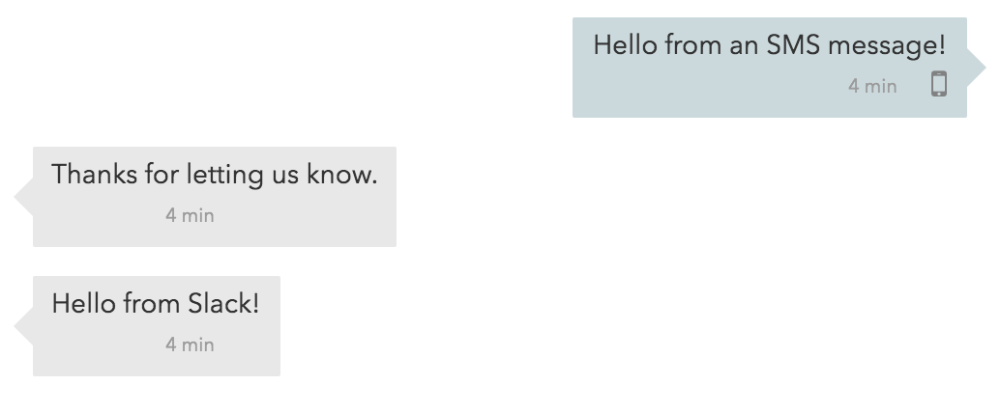

# smsbot - ☎️🤖

### what?

**smsbot provides an integration with Slack that connects SMS messages into channels.**

People can text an external number and have their messages posted into the channel. Channel users can respond to the messages and have their response sent back to the sender using SMS.

### how?

smsbot was developed in under a few hours and less than one hundred lines of code using a [serverless platform](http://openwhisk.org/) and [cloud](https://www.twilio.com/) [services](https://api.slack.com/).

More details in this blog post: 
https://medium.com/@jamesthom.as/building-an-sms-bot-for-slack-d52b5bc397e4


### setting it up

Follow the steps below to create your own instance of smsbot.

#### ibm cloud functions

- Register for an account with [IBM Cloud Functions](https://console.bluemix.net/openwhisk/).
- Follow the [instructions](https://console.bluemix.net/openwhisk/learn/cli) to set up the IBM Cloud Functions CLI.

#### serverless framework

Install the [The Serverless Framework](https://github.com/serverless/serverless).

```
npm install serverless
```

#### source code

Download the [source code](https://github.com/jthomas/smsbot) from Github and install the project dependencies.

```
$ git clone https://github.com/ibmets/smsbot.git
$ cd smsbot
$ npm install
```

Create a new file called `credentials.yml` with the following content.

```yaml
twilio:
    account:
    auth:
    number:
numbers:
slack:
    webhook:
```

#### twilio

Register an account with Twilio and provision [a new phone number](https://www.twilio.com/console/phone-numbers/search). Make a note of the phone number. Retrieve the account identifier and auth token from the [Twilio console](https://www.twilio.com/console).

Fill in the account identifier, auth token and phone number in the `credentials.yml` file.

```yaml
twilio:
    account: AC_USER_ID
    auth: AUTH_TOKEN
    number: '+441234567890'
```

*Important: the `twilio.number` property value must be a quoted string.*

#### phone numbers

During Twilio's free trial, you will need [manually verify each phone number](https://support.twilio.com/hc/en-us/articles/223136107-How-does-Twilio-s-Free-Trial-work-) that you want to send messages to. 

Fill in all verified numbers in `credentials.yml`.

```yaml
numbers:
    '+441234567890': Joe Smith
    '+441234567891': Jane Smith
```

*Important: the `numbers` property values must be a quoted strings.*

#### incoming webhook

Create a new [Incoming Webhook](https://api.slack.com/incoming-webhooks) integration for the Slack channel messages should appear in.

Fill in the `slack.webhook` property in `credentials.yml` with this url.

```yaml
slack:
    webhook: https://hooks.slack.com/services/XXXX/YYYY/ZZZZ
```

#### deploy application

Use The Serverless Framework to deploy your application.

```
$ serverless deploy
Serverless: Packaging service...
Serverless: Compiling Functions...
Serverless: Compiling API Gateway definitions...
Serverless: Compiling Rules...
Serverless: Compiling Triggers & Feeds...
Serverless: Deploying Functions...
Serverless: Deployment successful!

Service Information
platform:	openwhisk.ng.bluemix.net
namespace:	_
service:	smsbot

actions:
smsbot-dev-incoming    smsbot-dev-reply

triggers:
**no triggers deployed**

rules:
**no rules deployed**

endpoints:
**no routes deployed**
```

#### twilio webhook

On the [Phone Numbers](https://www.twilio.com/console/phone-numbers/incoming) page in the Twilio console, configure the "*Messaging*" webhook URL.

Use this Web Action URL, replacing `user@host.com_dev` with your namespace.

`https://openwhisk.ng.bluemix.net/api/v1/experimental/web/user@host.com_dev/default/smsbot-dev-incoming.http`

#### outgoing webhook

Create a new [Outgoing Webhook](https://api.slack.com/custom-integrations/outgoing-webhooks) integration for the Slack channel messages should appear in. Use `smsbot` as the *Trigger Word*.

Use this Web Action URL, replacing `user@host.com_dev` with your namespace.

`https://openwhisk.ng.bluemix.net/api/v1/experimental/web/user@host.com_dev/default/smsbot-dev-reply.json`

### usage

Send a text message to the phone number you registered through Twilio. smsbot should post the contents into Slack and send an SMS response with the message "*Thanks for letting us know!*". 


If you send a channel message starting with the trigger word (*smsbot*), the phone number should receive a new SMS message with the message text.



Awesome-sauce 😎.

#### issues / feedback / feature requests?

If you have any issues, comments or want to see new features, please file an issue in the project repository:

[https://github.com/ibmets/smsbot](https://github.com/ibmets/smsbot)

Made by [IBM Emerging Technology Services](https://emerging-technology.co.uk/).
